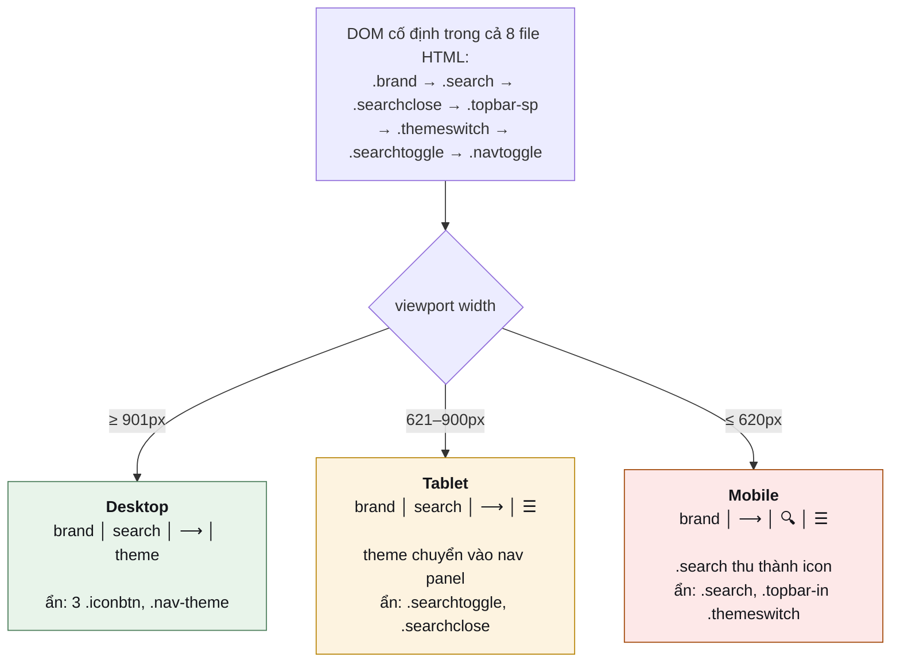
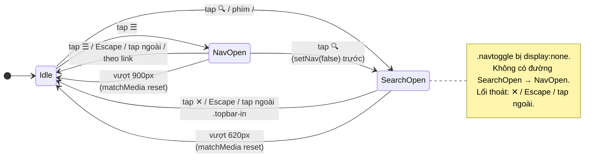
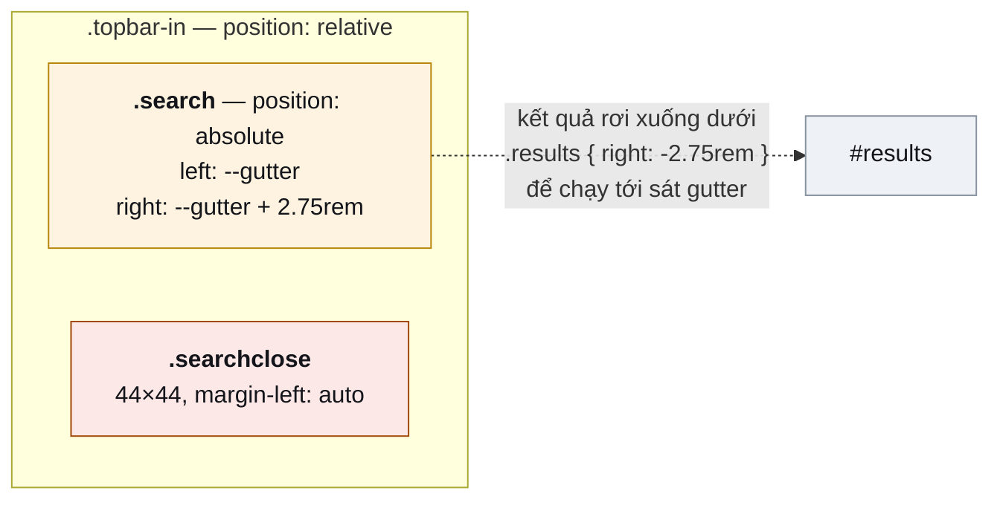
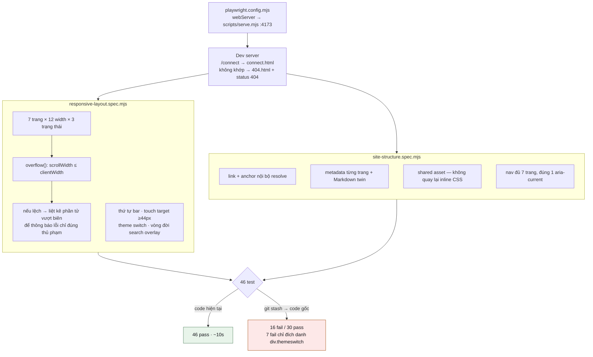

# Flow

## Top bar theo breakpoint

Cùng một DOM, ba hình dạng. Không có markup nào bị sinh ra hay xoá đi bằng JS — chỉ `display` đổi theo media query.

Lỗi gốc nằm ở nhánh Mobile: `.themeswitch` (98px, `flex: none`) chưa bị ẩn, nên hàng cần 373px trong khung 360px.

## Hai disclosure — state machine

**Không có chiều `SearchOpen → NavOpen`** là chủ ý, không phải thiếu sót. Overlay chiếm cả thanh nên nút Menu không còn chỗ — đúng pattern Stripe và VitePress. Điều đó chỉ chấp nhận được vì lối ra rõ ràng, nên test assert **các lối thoát** thay vì assert sự vắng mặt của nút Menu.

Hai nhánh `matchMedia` tồn tại để trạng thái không bị kẹt: xoay ngang máy hoặc kéo cửa sổ qua breakpoint mà attribute còn nguyên thì CSS mới không còn rule nào xử lý nó.

## Search overlay — layout khi mở

`.topbar-sp` **phải** bị ẩn ở trạng thái này. Nó cũng mang `margin-left: auto`; hai auto margin trong cùng flex row chia đôi khoảng trống và đẩy nút ✕ vào giữa field.

## Luồng test

Nhánh `git stash` là bước không bỏ được: một test không bao giờ đỏ thì không khoá được gì. Lần thử đầu dùng CSS override tự chế để tái hiện bug — **test vẫn pass**, vì riêng `min-width: 0` thêm vào `.search` đã đủ chặn tràn. Bản mô phỏng bug không phải là bug.

## Bản đồ file

| File | Vai trò |
|---|---|
| `assets/site.css` | `.iconbtn`, `.nav-theme`, `.themeswitch.wide`, 2 media query 900/620 |
| `assets/site.js` | `setSearch()`, `setNav()`, wire trigger, 2 nhánh `matchMedia` |
| `*.html` × 8 | topbar + `#nav` duplicate, byte-identical — patch bằng script |
| `scripts/serve.mjs` | `resolvePath()` mô phỏng GitHub Pages |
| `tests/site.mjs` | `PAGES`, `WIDTHS`, `TOUCH_MIN`, `overflow()` |
| `playwright.config.mjs` | nối test với dev server |
